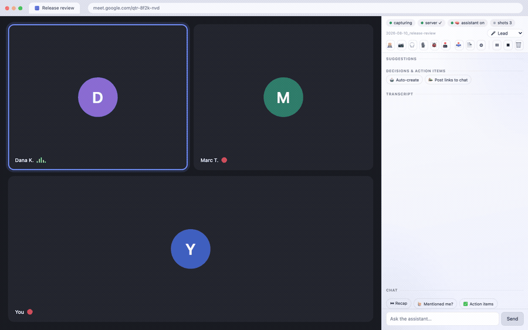

# Meet Live Assist

**Your own agent session, in the call with you.** It reads the Meet or Zoom transcript as it happens and
answers in a side panel while the call is still going: what was decided, who owns what, the risk you just
agreed to, and the sentence to say next, in the meeting's language.

<p align="center">
  
  <br />
  <em>A release review, fourteen seconds, panel docked beside the call. The conversation is invented and the
  cameras are off, as they are on most working calls. The interface is the shipping one.</em>
</p>

During a Google Meet or Zoom call this captures the transcript, shows it in a side panel, and hands it to
an assistant running on your own computer. The assistant answers back in the panel while the call is still
going: what to say, what was decided, who owns what, what you just agreed to that you should not have.

Transcripts, screenshots and chat are written to a folder on your disk and served by a server on
`127.0.0.1` that only you can reach. There is no account, no telemetry, and no server of ours anywhere.

**Where the words actually go, stated once and plainly.** The brain is your own Claude Code session, so
whatever you route to it - the transcript batches, your questions - leaves your machine for Anthropic under
*your* account, exactly as any other Claude Code session does. What never leaves is the stored record: the
files, the screenshots, the chat history. If a page tells you a live meeting assistant runs entirely on your
machine, it is either using a local model or it is not telling you the truth; this one borrows a brain you
already pay for, and that is the trade. See [Data flow](#data-flow) for the three-line version.

## Read this before you install

**You need an AI coding agent that speaks MCP - [Claude Code](https://claude.com/claude-code) is the one
this is tested with.** This ships the eyes, ears and hands - the capture, the panel, the local bridge - but
not the brain. The brain is an agent session on your own machine, reading the call through MCP tools. Without
one you get a working transcript recorder and an empty advice pane, which is not what the screenshots promise.

The adapter is plain JSON-RPC over stdio with nothing vendor-specific in it, so other MCP clients (Cursor,
Cline, Continue, Zed, Codex) can drive it - Codex CLI was checked and completes tool calls against the bridge.
One requirement is genuinely harder to meet elsewhere: the client has to hold a **persistent background
loop**, because MCP is client-pull and nothing on the server can
ever start a turn. [`MCP-CLIENTS.md`](MCP-CLIENTS.md) explains what to check and what is unverified.

**Your meeting is other people's conversation too.** Turning on captions is invisible to everyone else,
unlike recording, which Meet badges. So by default this posts one line into the meeting chat when capture
starts, saying an assistant is transcribing locally. You can edit that line or turn it off in Options.
Some jurisdictions require everyone's consent before a conversation may be recorded or transcribed; that
is your call to make, and `PRIVACY.md` says so plainly.

Requirements: Node 20+, Chrome 116+, Claude Code. Speaking *into* the call is macOS-only (it uses `say`
and `afplay`); elsewhere advice still appears in the panel and the server says why it cannot speak. Local
speech-to-text works anywhere `ffmpeg` and `whisper.cpp` do, and the panel's setup row shows which of the
two are actually present rather than failing quietly.

## Install (three steps)

```sh
git clone https://github.com/krystiangw/meet-live-assist-extension.git
cd meet-live-assist-extension
./install.sh          # installs the skill, registers the MCP tools, prepares the data dir
```

Then:

1. **Start the bridge server**, leave it running:
   `node server/transcript-server.js --pair`
2. **Load the extension**: `chrome://extensions` → Developer mode → *Load unpacked* → pick this folder.
   Pin it, click the icon. The panel collects its token from the pairing window on its own; there is
   nothing to copy. (Window expired? Run step 1's command again - it works against a running server too.)
3. **Open Claude Code** and ask it to assist your meeting.

`./install.sh` takes `MLA_USER`, `MLA_LANGUAGE`, `MLA_DOMAIN` and `MLA_TRANSCRIPTS_DIR` so the assistant
addresses you by name, in your language, and knows roughly what your meetings are about.

### Pick a profile

`MLA_PROFILE` decides which meeting types the assistant knows about and what it leads with. Everything else -
the markers, the modes, the board - is the same, because those turned out to be domain-neutral.

| Profile | For | It leads with |
| --- | --- | --- |
| `engineering` (default) | standups, incidents, refinement, QA | decisions, scope creep, risk, action items |
| `second-language` | any meeting not in your first language | 🟢 SAY - the sentence, ready to speak, in the meeting's language |
| `research` | user interviews, usability sessions | silence, leading-question warnings, guide coverage |
| `generic` | anything else | responding well in real time |

They are plain files in [`skill/profiles/`](skill/profiles/) - about a dozen lines each. Write your own and
pass its name; the installer refuses a profile it cannot find rather than silently using the default.

## What it stores, and how to get rid of it

Everything lives in one folder - `./transcripts` unless you set `MLA_TRANSCRIPTS_DIR`:

| File | What it is |
| --- | --- |
| `<date>_<meeting-code>.txt` | the transcript |
| `<...>.chat.txt`, `<...>.summary.md` | your chat with the assistant, and the post-call summary |
| `snapshots/<session>/*.jpg` | screenshots taken during screen-share |
| `.state/` | live meeting state, so restarting the server mid-call loses nothing |
| `.mla-token` | the shared secret the extension and the assistant authenticate with |

Files are owner-only (`0600`), the directory is `0700`, and anything older than 14 days is purged
automatically (`RETENTION_DAYS`, `0` keeps everything forever). The 🗑 button in the panel wipes a single
meeting - transcript, chat, summary, snapshots and state - immediately. To remove the whole thing: delete
that folder, delete `~/.claude/skills/meet-live-assist`, run `claude mcp remove meet-live-assist`, and
remove the extension from Chrome.

## Data flow

| What | Where it goes |
| --- | --- |
| Transcript, screenshots, panel chat, summaries | **Your disk, nowhere else.** Owner-only files, one folder, served by a process bound to `127.0.0.1`. |
| The call content you route to the assistant, and your questions | **Anthropic, via your own Claude Code session** - same path as anything else you do in Claude Code, your account, your terms. |
| Anything else | Nothing. There is no third party here. |

On Free / Pro / Max, whether your sessions improve the model is a setting you control and it changes the
retention period; [Anthropic's consumer terms](https://www.anthropic.com/news/updates-to-our-consumer-terms)
cover it and say explicitly that it includes Claude Code. Work and API accounts are on different terms.
Worth knowing before you point this at a conversation that is not only yours.

## What it does during a call

- **Live transcript** - captions scraped, streamed to the panel instantly, de-duplicated + monologue
  forced-flush before hitting the file/brain, with a conservative ASR glossary.
- **Colour-coded advice** from the brain (🟢SAY/🔵INFO/🟡SUMMARY/🟣EXPLAIN/🔴RISK/🟠ACTION), rich
  (links/images/diagrams/lists), each **copyable**; RISK fires an audible + notification cue.
- **Brain-liveness** pill (is a Claude session actually attached?), **capture watchdog** (warns if captions break).
- **Decisions & action-items board** with a one-click **Draft <your tracker>** (whatever you named in
  Options, or a plain note if you named nothing); **recap** quick-asks; two-way **chat**.
- **Autopilot** - flip 🤖 Auto-create and it stops proposing and starts doing: the ticket or the note is
  created as the action item comes up, no per-item confirm. 📣 Post links to chat shares the link with
  the room. Both are off until you turn them on.
- **Snapshots** (auto on screen-share + on demand), **TTS into the call**, **local STT** (whisper),
  **meeting modes** + type-awareness, **live presentation edits** + **debug** of the shared tab.
- **Talk-time**, **muted-mic** + **personal-mention** alerts; **post-call summary** export.

<p align="center">
  
  <br />
  <em>Sprint planning with autopilot on. Nobody typed anything into the panel: the correction, the decision,
  the ticket and the note all arrive while the meeting carries on.</em>
</p>

**A note on trust.** The assistant is your own Claude Code session with your own tools, and it reads a live,
untrusted audio feed. It is instructed to let *only what you type* authorize an action - no spoken line, under
any name, can make it act - but that is the model following its skill, not a wall. If you have connected
destructive tools to Claude Code, set their trust accordingly. `PRIVACY.md` says this plainly too.

**Landing page:** [`docs/index.html`](docs/index.html), also hosted at
**https://krystiangw.github.io/meet-live-assist/**.

Built by [Krystian Gwizdała](https://krystiangw.github.io/krystiangw/).

*Meet Live Assist is an independent project. It is not affiliated with, endorsed by or sponsored by Google or Zoom; "Google Meet" and "Zoom" are their owners' trademarks and are used here only to say which products this works with.*

## Licence, in plain words

[PolyForm Internal Use 1.0.0](LICENSE.md). Free, and **yes, you may use it at work** - "internal business
operations of you and your company" is a permitted purpose, whether or not your company is for-profit. You
may modify it for your own use.

What you may not do is redistribute it, fork it publicly, or sell it - as a product, a hosted service, or a
part of either. This is source-available, not open source, and the difference is deliberate: it is free to
use and stays owned.

If you want to do something the licence does not allow, ask. That is a conversation, not a refusal.

## Architecture (why it's shaped this way)

- **Streaming + state live in the side panel, not the service worker.** The SW is event-driven and
  gets torn down (~30s idle / 5-min cap); durable state is in `chrome.storage.session`, and the
  panel re-hydrates via a `restore` message on (re)connect.
- **Keep-alive:** the side panel holds a `runtime.connect` port and pings it every 20s; a
  `chrome.alarms` heartbeat (30s) wakes the SW even after it was unloaded.
- **Server POST happens in the SW** (has `127.0.0.1:8848` host permission), not the content script.

## The bridge server

The extension talks to a small local Node server (`127.0.0.1:8848`) that is the "brain" bridge:
transcript sink (`/append`), advice (`/advice`), board (`/items`), chat (`/chat`), snapshots
(`/snapshot`, `/snapshot-request`), TTS (`/speak`, `/voices`), STT (`/stt`), meeting mode (`/mode`),
presentation edits (`/edit`, `/dom*`), debug (`/debug*`), brain heartbeat (`/brain-ping`), summary
(`/summary`), per-meeting wipe (`/clear`), and health (`/health`).

**The assistant reaches it through MCP, not HTTP.** `server/mcp-server.js` is a zero-dependency stdio MCP
adapter over the same API, 13 tools. Register it once:

```bash
claude mcp add meet-live-assist --scope user -- node <repo>/server/mcp-server.js
```

It asks the running server where its data dir is (`/health` needs no token) and reads the token from there,
so it needs no environment. The keystone tool is `poll`: one call returns the transcript batch worth a turn,
the panel's state, and any pending results, with the read offset held server-side per assistant. That
replaces four or five `curl` calls a turn plus a byte offset kept in a shell variable - and it works with no
filesystem in reach, which is what a hosted deployment needs.

What MCP does **not** do is wake the assistant: the protocol is client-pull, so nothing on the server can
start a turn. A client-side loop polling `/poll?...&format=text` remains the wake source; it prints only
when something happened - a batch worth a turn, a panel state change, a message typed in the panel chat, a
failed meeting-chat delivery, or its own inability to reach the server. The state change matters most: it is
the only way pressing Stop can reach an assistant at all, since capture ends there and no later caption
would arrive.

Read positions are per **reader**, held server-side, and a reader nobody has seen before starts at the *end*
of the channel - `backlog=1` is how the wake loop asks for the meeting so far on its first read. The loop and
the `poll` tool are deliberately separate readers: reading is destructive, so sharing a position let a
mid-turn tool call swallow a wake the loop still owed. Positions are bounded per meeting and evicted
least-recently-seen, which never touches a loop that is polling.

**Multi-tenancy seam.** State is keyed by `(user, session)`; see `server/scope.js`. On a local install the
single user resolves to the data dir itself, so nothing about the layout changes. The seam exists so a
hosted profile can namespace users without a second code path, and so the guarantee that one user cannot
reach another's meeting is stated in one place and tested directly.

**Auth:** every route except `/health` requires an `X-MLA-Token` header. The server generates the token
into `<transcripts>/.mla-token` on first start; the brain reads that file, and the extension **pairs** for
it rather than being handed a copy by a human. Without the token any website you visit could reach the
localhost server.

**Pairing.** `GET /pair` returns the token exactly once, and only while a window is open - the server's
first ever boot, or a run with `--pair`, which against an already-running server just re-opens the window
on it. A claim must carry `X-MLA-Pair: 1`, which a web page cannot send without a preflight that betrays
its origin, and any `Origin` present must be `chrome-extension://`. The first claim closes the window and
the extension id that took it is logged. This does not stop another extension of yours that already holds
a `127.0.0.1` permission from racing you inside those two minutes, which is exactly why the window is not
left open. Manual paste still works and is still there in Options.

**Two files per meeting.** `/append` writes every caption to `<session>.txt` - the complete record, nothing
dropped - and only appends a batch to `<session>.wake` when the batch is worth waking the brain for
(decisions, blockers, your name, real questions, accumulated substance). The assistant reads the wake channel
(through `poll`), never the raw transcript: that is what keeps a 40-minute call from costing hundreds of brain
turns. A held-back batch is never lost - it rides along with the next wake, and a force-flush fires after
`WAKE_FORCE_MS` regardless. `poll` reads that channel and deliberately does not force it: flushing on a
2-second poll would hand back everything the gate was holding, which is the gate deleted.

### Stand up the server

The server is packaged to stand alone as `meet-live-assist-server` (zero dependencies,
`server/package.json`), so a user who only wants to run it needs neither this repo nor a clone. **It is not
on npm yet**, so `npx meet-live-assist-server` will 404. Publishing it is a deliberate step, not a side
effect of a docs edit.
From a clone it is just:

```bash
node server/transcript-server.js --pair
```

It writes to
`~/meet-live-assist/transcripts` unless `TRANSCRIPTS_DIR` says otherwise. **Node 20+ is the only hard
requirement**; `ffmpeg` and `whisper-cli` are optional and only local STT depends on them. Binary paths
resolve from Homebrew, `/usr/local`, `/usr/bin` and then `PATH`, so Linux works as well as either Mac
architecture. **Text-to-speech is macOS-only** (`say` + `afplay`); elsewhere advice still shows as text in
the panel and only spoken output is missing. Details: [`server/README.md`](server/README.md).

Publishing a new version is `cd server && npm publish` (check `npm pack --dry-run` first: it should be
six files, ~42 kB - the server, the MCP adapter, the state store, the wake-channel cut helper, a README and the manifest).

### Autostart it on a Mac (launchd)

From a clone, if you want it to come back after a reboot:

```bash
git clone https://github.com/krystiangw/meet-live-assist-extension.git
cd meet-live-assist-extension
MLA_DRY_RUN=1 ./server/install-server.sh   # optional: see the plan + generated plist, change nothing
./server/install-server.sh                 # install as a launchd agent + start it
```

It resolves the machine-specific bits itself (node binary via `process.execPath` - a bare `which node` under
fnm/nvm points at a per-shell shim that dies with the shell; Homebrew prefix for `ffmpeg`/`whisper-cli`, so
Intel and Apple Silicon both work), writes `~/Library/LaunchAgents/com.mla.meet-transcript-server.plist`,
waits for `/health`, then tells you where the token lives. To pair an extension against the job it just
installed: `node server/transcript-server.js --pair`.

- **Only Node 20+ is required.** `ffmpeg` and `whisper-cli` are optional (`brew install ffmpeg whisper-cpp`);
  without them the server still runs - TTS-into-the-call and local STT are the parts that go dark.
- **Re-run it after `git pull`** - it is idempotent and restarts the service with the new code.
- Override defaults with env vars: `TRANSCRIPTS_DIR=~/mla PORT=8849 ./server/install-server.sh`.
  Default transcripts dir is `~/meet-live-assist/transcripts`, deliberately **outside** the repo - meeting
  text and screenshots are PII and must not risk being committed.
- The **brain** reaches the server through the MCP adapter, which asks it where its data is, so changing
  `TRANSCRIPTS_DIR` needs no change on the assistant's side. Only the launchd plist and the extension's
  token need to agree.

Manual run instead of launchd (handy for debugging - logs to your terminal, `Ctrl-C` stops it for real):

```bash
PORT=8899 TRANSCRIPTS_DIR=/tmp/mla node server/transcript-server.js
curl -s http://127.0.0.1:8899/health
```

**Operating it**

| | |
| --- | --- |
| health | `curl -s http://127.0.0.1:8848/health` |
| what the panel is asking of the brain | `curl -s -H "X-MLA-Token: $(cat <transcripts>/.mla-token)" "http://127.0.0.1:8848/status?session=<session>"` |
| logs | `~/Library/Logs/meet-live-assist-server.log` |
| restart | `launchctl kickstart -k gui/$UID/com.mla.meet-transcript-server` |
| stop for real | `launchctl unload -w ~/Library/LaunchAgents/com.mla.meet-transcript-server.plist` |

`KeepAlive` is on, so `kill`/`pkill` does **not** stop it - launchd restarts it within seconds.

**A restart mid-call is survivable.** Advice, the decisions board, chat, the wrap-up, the wake buffer and
each assistant's read position are snapshotted to `<transcripts>/.state/` and reloaded on boot, so a bounce
costs at most the last couple of seconds (`STATE_SNAPSHOT_MS`, default 2000) rather than the meeting. Two
things deliberately do **not** come back, because they are answers about one call and a recurring series
reuses its meet code: the panel's Stop/pause state, and consent (🕹 drive, autopilot). You will still see a
brief capture gap while the process is down.

Only one process may write a given data dir. A second server on the same `TRANSCRIPTS_DIR` serves normally
but does not persist (it logs why), so a sandbox run beside the launchd job cannot rewind the live meeting.

**Config** (all optional, set in the plist's `EnvironmentVariables` or on the manual command line):

| var | default | what it does |
| --- | --- | --- |
| `PORT` | `8848` | the extension has host permission for `127.0.0.1:8848` - changing it needs a manifest change |
| `TRANSCRIPTS_DIR` | `<server-dir>/../transcripts` | where transcripts, snapshots and `.mla-token` live |
| `RETENTION_DAYS` | `14` | purge transcripts + snapshots older than this (`0` = keep forever) |
| `WAKE_BASE_MS` / `WAKE_MAX_MS` | `10000` / `90000` | wake-gate backoff window: starts here, doubles on an empty batch up to the max |
| `WAKE_FORCE_MS` | `180000` | flush whatever is buffered after this long, gate or no gate |
| `WAKE_MAX_CHARS` | `4000` | flush early once a batch gets this big |
| `WAKE_MIN_GAP_MS` | `8000` | floor between two wakes |
| `MLA_URGENT_NAMES` | *(empty)* | comma-separated names that wake the assistant immediately - include the manglings your captions produce |
| `WAKE_ALL` | `0` | `1` delivers every line with no gating, for a call where nothing is small talk (~4x the turns) |
| `FFMPEG` / `WHISPER_CLI` / `WHISPER_MODEL` / `TTS_VOICE` | Homebrew paths / `Zosia` | TTS + STT plumbing |

The launchd plist is generated by `install-server.sh` from your machine's actual paths - there is no
template to edit, because a checked-in one would carry someone else's absolute paths and fail on yours.

## Two builds, and the skill that matches each

`./build.sh` zips everything this repo can do. `./build.sh --public` produces the **store** zip: it drops the
`debugger` permission and strips the surface that acts on pages (DOM edits, agent-driven clicks,
network/console reads), leaving the assistant that only sees and hears. The store reviews for a single
purpose, and the full build reads as a remote control. The cut is driven by `mla:pro-start` / `mla:pro-end`
markers in `src/`; the build refuses to ship a dangling reference to anything it removed.

The bundled skill is cut the same way and, more importantly, is a **template** - it addresses the user by
name, answers in their language and pre-briefs against their domain, none of which can be hardcoded for
someone else. `install.sh` fills it:

```bash
MLA_USER="Ada Lovelace" MLA_LANGUAGE=Polish MLA_DOMAIN="backend eng, payments" ./install.sh
MLA_PRO=1 ./install.sh      # keep the page-control sections (pairs with the full build)
```

It refuses to run on the author's machine without `MLA_FORCE=1`, because there the destination is the
canonical personal skill rather than a copy of the template.

## Checks

```bash
npm run lint            # node --check over src/ and server/
npm test                # all five suites below, ~296 checks
npm run test:scope      # the (user, session) rules in isolation
npm run test:server     # auth gate, session guard, round-trips, restart survival
npm run test:panel      # every request sidepanel.js makes, replayed without a browser
npm run test:mcp        # the MCP adapter over stdio JSON-RPC
npm run test:limits     # the size caps, with non-ASCII text
npm run test:retention  # the retention sweep, and content not leaking between meetings
```

Both run in CI on every push, along with both builds.

The suites are split by what they protect, not by layer. `test:panel` exists because the panel is the half
of the product a server test never touches - a renamed route or a cursor that stops advancing looks fine
from the assistant's side and leaves the user staring at an empty panel. `test:limits` is the only suite that
uses non-ASCII text, and three real defects were hiding behind English-only fixtures. `test:retention` needs
file timestamps and restarts with a gap, so it does not belong in the fast path.

## Load it (unpacked)

1. Make sure the transcript server is running - `curl -s http://127.0.0.1:8848/health` → `{"ok":true,...}`.
   On a fresh Mac install it first: `./server/install-server.sh` (see *Stand up the server on a Mac* above).
2. `chrome://extensions` → enable **Developer mode** → **Load unpacked** → pick this folder.
3. Pin the extension; click its toolbar icon to open the side panel.
4. The panel pairs itself with the server if a pairing window is open (`--pair`). If it is not, the pill
   says so and you can still paste the token by hand: right-click the icon → **Options** →
   `cat <TRANSCRIPTS_DIR>/.mla-token`. The token is per-machine; one from another Mac will be rejected.
   Optionally set TTS voices and your name(s) (for mention alerts). The panel's ⚙ shows a setup checklist.
5. If you ever ran the predecessor Tampermonkey userscript
   (`server/legacy-userscript.meet-captions-to-file.user.js`), disable it - both capturing at once
   duplicates every line.

## Does it actually work? Check these on a real call

Automated tests cover the server; these cover the half that only a live meeting exercises.

- [ ] Join a call → within a few seconds the panel shows `capturing` and live lines, and
      `<TRANSCRIPTS_DIR>/<date>_<code>.txt` starts growing.
- [ ] `server ✓` is green and the 🧠 pill names your attached assistant. A pill that says nobody is
      attached while a session is running means the skill never armed - that is the failure mode worth
      catching, because everything else looks fine while no advice will ever arrive.
- [ ] Ask the assistant something in the panel chat and get an answer back **in the panel**.
- [ ] **Service-worker death:** let the SW go idle (or Stop it in `chrome://serviceworker-internals`) and
      keep talking. Capture resumes and the panel re-hydrates without a reload. A 10-minute call should
      have no gaps.
- [ ] Share your screen → snapshots start on their own; the 📷 pill shows how stale the assistant's view is.
- [ ] Leave the call → the panel shows `call ended`.

**How the halves talk.** The brain POSTs advice (`POST /advice {session, marker, text}`) and the panel
polls `GET /advice?session=&since=`, rendering each with its colour marker. Snapshots go to
`<TRANSCRIPTS_DIR>/snapshots/<session>/` (~40 kept) for the assistant to read on demand. Anything the
assistant does outside the panel - a ticket, a message - follows the tiers in the skill, and the panel
itself is display-only.

### Permissions
The `<all_urls>` host is **optional**, requested at runtime on a user gesture (starting co-pilot, turning on
🐞 Debug, or the setup checklist's *Grant* button), so the host prompt stays limited to **Meet + Zoom +
localhost**. `debugger` stays a **required** permission - Chrome forbids listing it as optional - so it's in
the install prompt (heavier review; a public build can drop it, the code degrades gracefully). Token auth
closes the "any website can drive the localhost server" hole. Build the store zip with `./build.sh`
(→ `dist/`, extension files only). Full listing + justifications: `STORE.md`.

> Reloading an already-installed copy will drop the now-optional `<all_urls>` grant - re-grant once from the
> panel (co-pilot / 🐞 / ⚙ setup → Grant).

## Roadmap

- **Mute-aware mic capture** (deferred 2026-07-28 - idea worth keeping). Muting yourself in Zoom does not stop
  the OS microphone, so the `mic` STT channel keeps recording asides nobody in the call heard, and the brain
  treats them as things you said in the meeting. Don't drop them - **label them** `You (muted):` so muting
  becomes a deliberate private voice channel to the assistant (still authorizes actions; never quotable as
  something said to the room). Open question is only how to read the state: the toolbar button is localized
  ("Wyłącz wyciszenie" / "Unmute"), so it needs a state attribute or an icon class, not a text match - the same
  fragility that already bit the caption selectors.

- **Auth north-star (product):** user authorizes a provider (Claude, later ChatGPT) in the extension's
  settings and it "just works." Reality: the Agent SDK / API is **API-key based, not account-OAuth**, and a
  pure extension can't run the MCP agent brain (needs Node). So the full-brain path needs a local bridge or a
  hosted backend; the pure-extension path is BYO-key (weaker, no MCP). Revisit in Phase 3.
- **Phase 2:** replace caption scraping with `chrome.tabCapture` audio → streaming STT; auto-detect "key
  moments" for snapshots; in-panel chat.
- **Phase 3 (optional):** Agent SDK brain (`@anthropic-ai/claude-agent-sdk`, `settingSources:["user"]` to
  inherit CLAUDE.md + MCP) via local bridge, or backend proxy / BYO-key (Path B) for sharing; privacy policy;
  Workspace private store.
